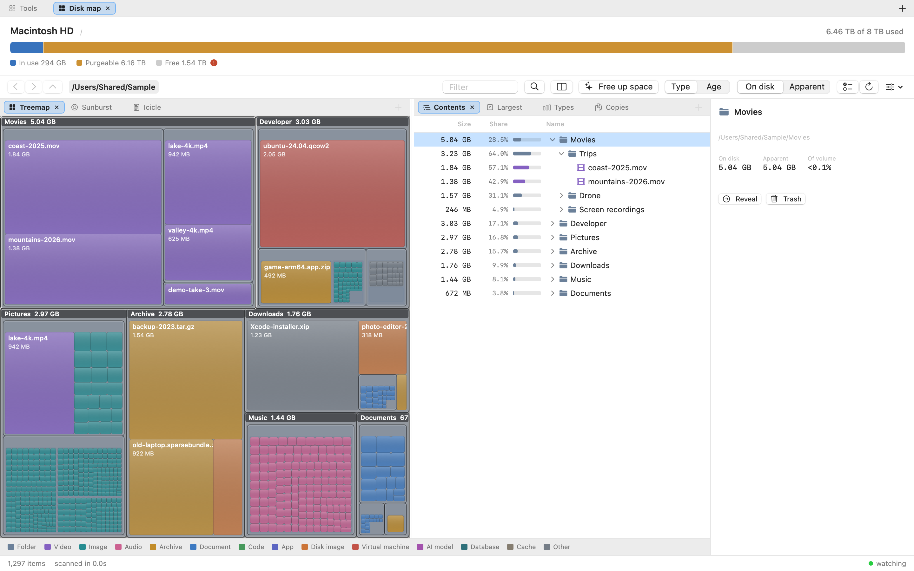
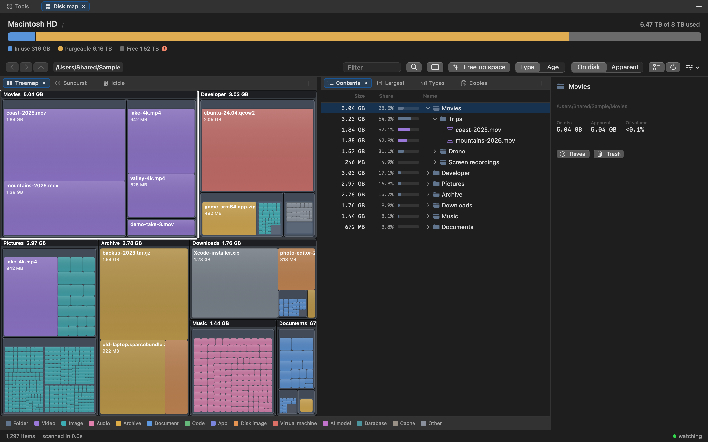
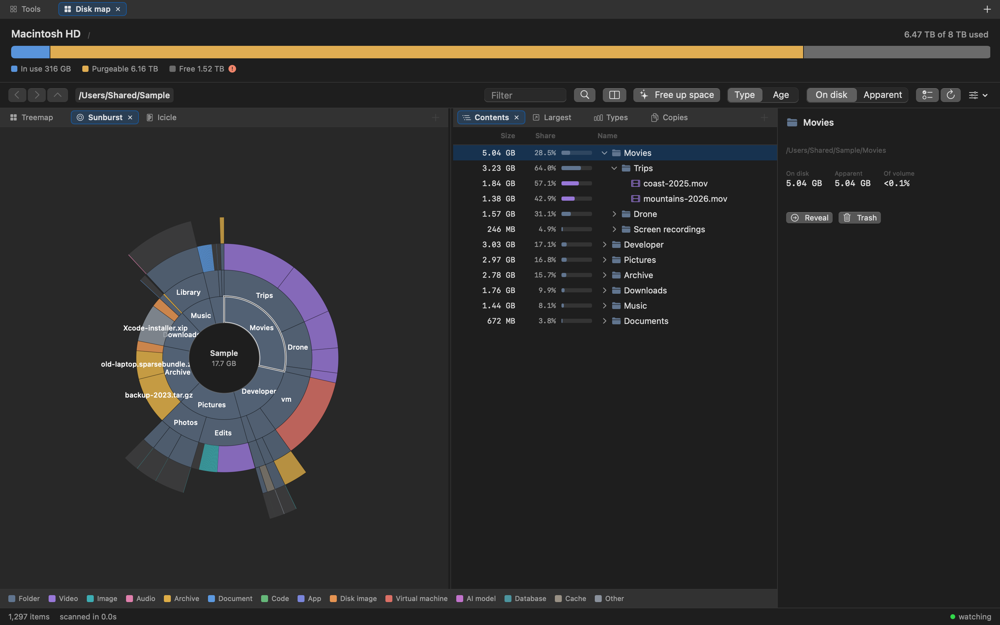
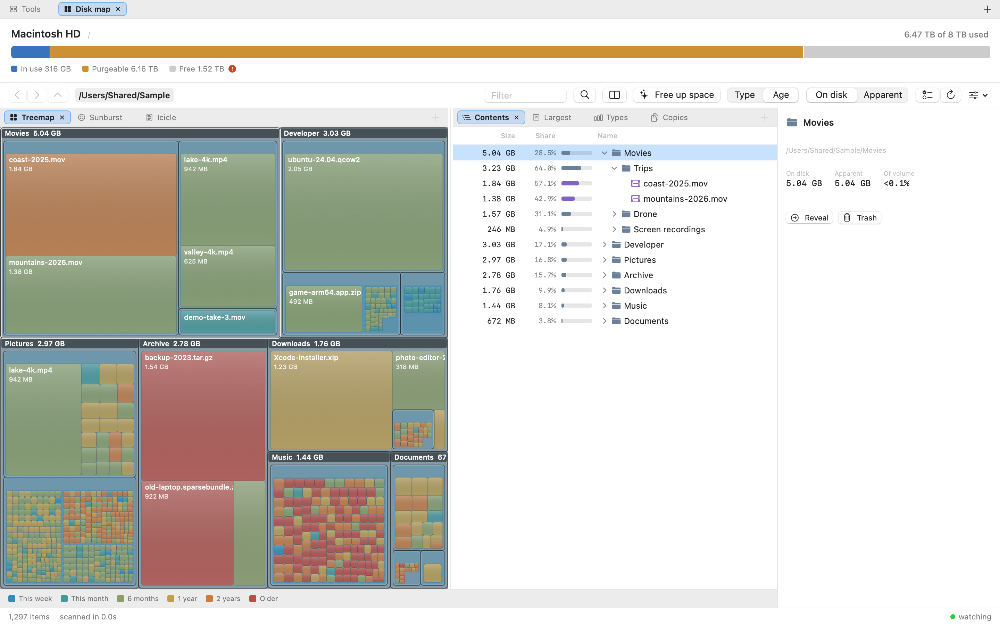
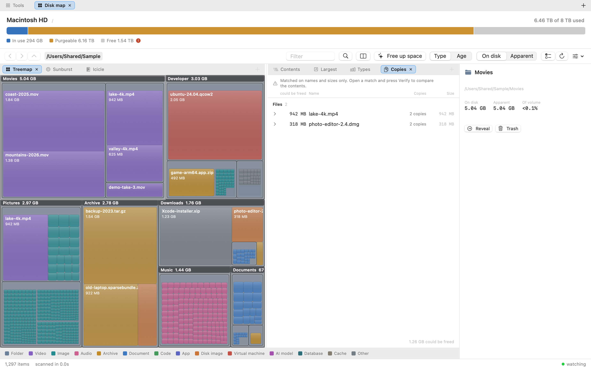

# Disk Map

A disk space analyzer for macOS, in the spirit of TreeSize. Native Swift, no
sandbox, built to report numbers you can act on.



Website: <https://mmdemirbas.github.io/diskmap/>

## Why it exists

Finder's "available space" is not free space. Finder shows
`volumeAvailableCapacityForImportantUsage`, which counts *purgeable* content —
evictable iCloud files, caches, local snapshots — as if it were already free.
On the machine this was built on:

| | |
|---|---|
| Capacity | 8.00 TB |
| Finder says available | **7.25 TB** |
| Actually writable now | **1.14 TB** |
| Purgeable, counted as free by Finder | **6.12 TB** |

Disk Map shows all of these side by side, and explains every byte it cannot
attribute to a file rather than rounding the difference away.

## Three ways a disk analyzer lies, and what this does instead

**Apparent size vs. bytes on disk.** Summing file sizes over the home folder on
this machine gives 15.24 TB — on an 8 TB disk. The scanner records *allocated*
size (`ATTR_FILE_ALLOCSIZE`) as the primary metric, which is what actually
changes when you delete something. Apparent size is shown next to it.

**iCloud placeholders.** 1.43 million files here are dataless stubs: they report
a size but occupy zero bytes locally. Deleting them frees nothing. They are
detected via `SF_DATALESS`, counted as zero, and flagged in the UI. The scanner
never opens a file, so browsing never triggers a download.

**Hard links and firmlinks.** Extra links to one inode are counted once.
Scanning `/` naively walks `/Users`, `/Applications` and `/private` twice,
because they are firmlinks onto the Data volume; those paths are excluded.

## Install

```sh
./install.sh
```

That is the whole thing, and it does not prompt for a password. It checks the
toolchain, creates a code-signing certificate if you do not have one, builds,
installs to `/Applications`, then opens the Privacy pane and a Finder window so
you can drag the app in to grant Full Disk Access. It ends with an explicit
`Installed` or `Failed` block, naming the identity it actually signed with.

```
./install.sh --dev       run from ./build without installing
./install.sh --no-open   skip opening the Settings and Finder windows
```

`make install`, `make dev` and `make test` wrap the same steps; `make help`
lists them. Every script takes `--help` and documents what it touches:

```sh
./install.sh --help          ./uninstall.sh --help
Scripts/build-app.sh --help  Scripts/make-signing-cert.sh --help
```

Two things the installer handles that are easy to get wrong by hand:

- **The certificate.** Full Disk Access is granted to a *signed identity*. An
  ad-hoc signature changes on every build, so macOS treats each rebuild as a
  different app and drops the grant. The installer creates a stable local
  certificate once, valid for ten years.
- **Full Disk Access itself.** Without it, parts of the disk stay invisible and
  the totals come up short. The status bar says so explicitly, with a button
  that opens the right settings pane, rather than quietly under-reporting.

## Uninstall

```sh
./uninstall.sh
```

It prints exactly what it found, waits for confirmation, then removes the app,
its preferences, the keychain certificate and the Full Disk Access grant. Run it
from anywhere in the repo; it is safe to run twice.

```
./uninstall.sh --dry-run     show the plan and change nothing
./uninstall.sh --yes         skip the confirmation
./uninstall.sh --keep-cert   leave the certificate, e.g. before reinstalling
./uninstall.sh --build       also delete this repo's build artifacts
```

By default it leaves the repo's `.build` and `build` directories alone: those
belong to the checkout, not to the machine, and `make clean` covers them.

Two things it does that deleting the `.app` by hand does not:

- **Resets the TCC grant** (`tccutil reset SystemPolicyAllFiles`). Otherwise a
  dead entry stays in System Settings, pointing at an app that no longer exists.
- **Drops the preferences domain as well as the plist.** `cfprefsd` caches
  preferences in memory and writes the file back after you delete it, so
  removing the plist alone does not stick.

### Two macOS details worth knowing

`security import` cannot read a PKCS#12 written with current OpenSSL defaults,
and fails outright on an empty password: the certificate has to be exported with
`-certpbe PBE-SHA1-3DES -keypbe PBE-SHA1-3DES -macalg sha1` and a real password.

`security find-identity -v` lists only *trusted* identities, so a self-signed
certificate never appears there even though `codesign` signs with it happily.
Detection has to use the listing without `-v`. Because of that, no trust
settings need changing, which is why the install needs no password.

A third: the pre-Ventura Privacy pane URL
(`x-apple.systempreferences:com.apple.preference.security?Privacy_AllFiles`)
opens **no window at all** on macOS 13 and later, while `open` still reports
success. The current identifier is `com.apple.settings.PrivacySecurity.extension`.

## Appearance and language

Light and dark are both first-class; the treemap uses a separate palette for
each rather than the same colours at a different opacity. English and Turkish
ship in the app, switchable from the toolbar or the menu bar without a restart,
and independently of the system language. Numbers follow the language you pick,
so sizes read `1.5 GB` in English and `1,5 GB` in Turkish.

## Choosing what to measure

A whole volume, one folder, or **several folders measured as one total** —
useful when the thing you care about is spread across `~/Downloads`,
`~/Movies` and an external drive.

- **Drag folders onto the window.** On the start screen they queue up; on a
  result they start a new scan.
- **Choose Folders…** opens the standard picker with multiple selection on.
- Duplicates, symlinks pointing at a folder already chosen, and any folder
  **already inside another chosen folder** are dropped, with the reason shown.
  Keeping a folder and its parent would count the child's bytes twice, and a
  disk analyser reporting more than the disk holds is worse than useless.
- A folder on another volume mounted *below* a chosen folder is not treated as
  nested, because the scan does not cross mount points and so never reaches it.
- Hard links are counted once even when the two names live under different
  chosen folders.

When several folders are measured together the breadcrumb root reads
"3 locations", and each folder appears as a top-level block in the treemap.
The scan total is not compared against the volume's used space in that case:
subtracting a few folders from a whole disk yields a precise, meaningless
number.

## Views

Six ways to look at the same scan, because they answer different questions.

- **Treemap.** Area is bytes, so the biggest rectangle is the thing worth
  deleting. Best for "what is taking the space".
- **Sunburst.** One ring per level, arc length proportional to size. A treemap
  spends every pixel on area and buries depth; here depth *is* the radius, so a
  long chain of nested folders shows as a spoke instead of vanishing into a
  block. Best for "what shape is this tree".
- **Icicle.** Stacked bars, one row per level, width proportional to size. The
  treemap and the sunburst both ask you to judge two dimensions at once; here
  size is length and nothing else, so siblings at the same depth line up as a
  row you can read across and a path reads top to bottom as a column. Depth is
  bounded by the window rather than a constant, so a taller window shows more
  levels. Best for "how does this compare to its siblings".
- **Largest files.** The biggest files anywhere below the current folder, with
  their paths. The tree table answers "what is in this folder"; this answers
  "what should I delete", which is usually one huge file six levels down.
- **By type / by age.** Where the space went by kind of file, and by how long
  ago it was touched, with a line like *"29.3 GB untouched for over two years"*.
- **Copies.** Duplicate *folders* first, then duplicate files, ordered by what
  deleting the extras would free.

  A folder is reduced to a hash of everything below it: each file contributes
  its name and byte length, each folder the combined hash of its children. A
  folder's own name is left out, so a renamed copy still matches, and children
  combine commutatively because directory order is not stable between two
  copies of the same tree. Two folders with the same hash hold the same names
  at the same sizes in the same shape. Folders that share *most* of their
  children are reported too — "3 of 4 items shared" — which is the case that
  actually turns up: two copies of a library where one has a few more files in
  it.

  Files are matched the same way, on name and size together, and a file inside
  a folder that already matched is not listed again. Hard links are excluded:
  they are already one set of bytes under two names, so deleting one frees
  nothing and listing them would promise space that does not exist. Nothing is
  read from disk for any of this, which is what keeps it as fast as the rest of
  the app and safe on iCloud placeholders — reading one would pull it down from
  the network.

  **Verify** is the answer to what metadata cannot settle. Open a match and it
  reads every byte of every copy, hashes them, and says whether the contents
  actually agree. The button says what it will read before you press it, the
  run reports progress and can be stopped, and files that exist only in iCloud
  are counted rather than downloaded — a match with unread files is reported as
  "matched, but N files were not read", not as identical.

Age colouring works on the treemap, the sunburst and the icicle alike.

| | |
|---|---|
|  |  |
|  |  |

The pictures are of a made-up folder tree, not a real disk;
`Scripts/screenshots.sh` builds the tree and renders them again.

What grew since the last scan is its own screen; see
[What changed since last time](#what-changed-since-last-time).

## Using it

- **Tree table.** Folders open in place with the disclosure triangle, so you can
  compare two branches without losing your position. Indentation is applied
  *after* the size and share columns, so those stay in one straight track
  however deep you go and can still be scanned down the page.
- **Navigation.** Back and Forward (`⌘[` / `⌘]`) retrace where you have been,
  `⌘↑` goes to the enclosing folder, the breadcrumb jumps to any ancestor in one
  click, and double-clicking empty space in the treemap goes back out.
- **Treemap** — area is bytes on disk. The biggest rectangle is the thing worth
  deleting. Folder frames and headers show which folder owns a block.
- **Double-click** a folder to descend, breadcrumb or ⌘↑ to go back up.
- **⇧⌘R** reveals the selection in Finder. **⌘⌫** moves it to the Trash — the
  real Trash, so Finder's *Put Back* works. **⌘Z** undoes it.
- **Live** — FSEvents keeps the tree in step with the disk. Every event is
  reduced to "relist one directory", reusing untouched subtrees, so an update
  costs the entries in that folder rather than a rescan.
- **On disk / Apparent** toggle switches the metric everywhere at once.

## How it works

| Piece | Approach |
|---|---|
| Traversal | `getattrlistbulk(2)`, one syscall per batch of entries instead of `readdir` + `stat` per file |
| Parallelism | Work-stealing directory queue, saturates at 8–12 threads |
| Storage | Structure-of-arrays, 32-bit node ids, contiguous child blocks — no `nextSibling` pointer |
| Aggregation | Children always have a higher index than their parent, so subtree totals are one reverse pass |
| Layout | Squarified treemap, recursion stops where a cell is too small to see |

### Measured on this machine

| | |
|---|---|
| Throughput | ~155k entries/s at 12 threads (38k/s single-threaded) |
| Home folder | 48.7 s cold, 761 MB peak footprint |
| Volume projection | ~77 s for 12M inodes |

Numbers are from an M-series Mac with an 8 TB APFS volume; they scope to that
machine, not to hardware generally.

## Cost, measured

A full scan of an 8 TB startup disk holding 11.6 million files:

| | |
|---|---|
| Time | 66-70 s (~166k entries/s, 12 threads) |
| Peak memory | 0.69 GB, max RSS 0.78 GB |
| Tree in memory | 568 MB — 49 bytes per node |
| CPU split | **user 12.7 s, sys 288 s** |

That last row is the one that decides where optimisation is worth doing: 96% of
the CPU is the kernel reading directories. Rewriting the Swift side could move
about 4%, so the effort went into memory instead, where three changes took peak
usage from 1.32 GB to 0.69 GB without dropping a single file:

- **Scan straight into the destination store.** Scanning each volume into its
  own store and grafting it afterwards kept two full copies alive at the
  moment of the copy.
- **Size the arrays once**, from the volumes' own used-inode counts, instead of
  growing 11.6M nodes geometrically and leaving 350 MB of slack behind.
- **Intern names.** 11.6M nodes carry only 3.4M distinct names — `Contents`,
  `Resources`, `package.json` recur endlessly — so storing each once cut the
  name blob from 238 MB to 105 MB.

The report panels walk the subtree again rather than caching per-node totals,
on demand when a panel opens rather than as part of the scan. On the home folder
above — 9.58M nodes:

| | |
|---|---|
| Duplicate files | **0.07 s**, 51,473 candidates, 7,602 groups, 281 GB |
| Duplicate folders | **0.59 s** total, of which **0.23 s** is hashing all 9.6M nodes; 11,326 candidates, 400 identical and 1,201 partial |
| Verifying a match | 9.29 GB read in **4.2 s** (2.2 GB/s), confirmed identical |
| Laying out a view | never reached the 40 ms recording threshold, on a tree of 3M nodes; a 20-cell icicle measured 0.046 ms |

Those come from `dmbench metrics`, which reads what the app recorded rather than
from a stopwatch held over one run. Four scans of the same home folder came in
between 49.3 s and 53.5 s, at 180k–195k entries/s, with a memory footprint of
490–495 MB.

The layout row is the reason the treemap does not need work: it lays out the
level being viewed, with a byte-threshold prefilter, so its cost follows the
number of visible cells rather than the size of the tree.

The folder pass hashes every node, so it costs 8 bytes per node while it runs
(77 MB on that tree) and is kept across navigations, since the hashes only
change when the tree does.

Run `dmbench scan <path>` for the same breakdown on any tree, or
`dmbench dupes <path>` for the duplicate pass on its own.

## Freeing space, not just seeing it

Finding 600 GB of duplication and then deleting it one file at a time is not a
disk tool, it is a report. Three things close that gap.

**Free up space** (⇧⌘K) proposes where the easy space is, ordered by how safe
each one is to accept rather than by size — what a toolchain rebuilds by itself
first, then what leaves a copy behind, then what only you can judge. Sorting by
size would put the most consequential decision at the top, which is the wrong
advice for someone in a hurry.

Two rules keep it honest. Folders called `build` or `target` are never proposed,
because those are ordinary words and one may hold your work; only names that
essentially never contain typed-in content qualify. And a dotfile home like
`~/.gradle` is never proposed whole — it holds `gradle.properties`, which is
proxy credentials and settings you typed once — so only the parts underneath it
that a build regenerates are offered.

**Ticking copies** in the Copies panel builds a selection that is deliberately
separate from the highlight, so looking at something can never become deleting
it. The action bar appears only once something is ticked.

**Nothing is deleted without seeing what stays.** The confirmation shows copies
as whole groups — every copy, kept and removed alike, on one card, each row
labelled *Stays* or *Trash* with its full path and size. "Delete this one" is
not a judgement anybody can make without seeing which one survives.

**It is editable, not take-it-or-leave-it.** Click any row to flip it, or press
*Keep this one* to keep that copy and remove the others in a single click. The
total at the bottom is the total of what is ticked right now, and the last
remaining copy cannot be ticked at all. It re-plans from the tree when you press
the button and refuses to act if anything moved in between, and one undo puts
the whole batch back.

**Never touch these** is a list that persists across launches. A folder on it is
never proposed and can never be ticked — one right-click in the review adds it.
It is deliberately *not* applied to the scan: excluding a folder from
measurement would quietly make every total on screen wrong, and a disk tool that
lies about its numbers to be convenient is worse than one that suggests
something you did not want.

The rules that protect your data live in `TrashPlanner`, in the core, where
tests prove them rather than in a view where they would be conventions:

- at least one member of every group the app called copies must survive —
  counting a member as surviving only if it is neither selected nor inside a
  selected folder, because selecting one copy and the other copy's parent takes
  both and neither selection looks dangerous alone;
- a scan root is never a target;
- an item inside an already-selected folder is dropped rather than trashed twice;
- items the tree already calls gone are dropped;
- a path that cannot be shown to be inside the scanned tree is refused.

**Deleting inside a synced folder is not a local operation.** The sync client
removes the file from the service and from every other device, and Finder's
*Put Back* only restores the local copy. Google Drive, OneDrive, Box, Dropbox
and iCloud Drive are detected, and the confirmation carries a warning above the
list naming the provider. This matters because the app ranks duplicate folders
by size, so on a machine with a mirrored Drive the biggest match — and the most
dangerous deletion available — is very often inside one.

The Trash is reported and never proposed for deletion. Emptying it is the one
operation that cannot be taken back, so the app shows the size and opens Finder.

## Comparing two folders, and making one match the other

The Copies panel says two folders look alike. It cannot say *what is different
about them*. ⇧⌘C can: from the toolbar, from the Scan menu, from a right-click
on a folder in the tree, or straight off a pair in the Copies panel.

Both sides are walked fresh rather than read out of the current scan. A sync
acts on the disk as it is now, and a tree from ten minutes ago is a different
disk — and it means two folders can be compared whether or not either was ever
scanned.

**What counts as the same** is a name at the same length on both sides. Nothing
is read, which is what keeps this as fast as the rest of the app and safe on
iCloud placeholders, and the modification date is shown but never decides — so a
plain `cp -R`, which shifts every date, does not make two copies look completely
different. The cost is that a file edited without changing its length reads as
identical here. **Check the contents** is the answer to that: it reads every
byte of both sides and names the files where they disagree.

**One row per decision.** A folder the other side does not have at all is one
row, not the ten thousand files inside it; so is a folder whose contents match
all the way down, where the subtree hashes agree and the walk stops. The counts
in the key are items rather than rows, because "1" next to "2 only on the right"
would read as though the two were comparable — and when a filter is narrowing
the list, the number of rows actually on screen is said in its own words beside
them.

**Two panes, one row each.** Name, size and date down both sides, the same
columns at the same x, and the relation between them in the gutter: `=`, `≠`,
`→`, `←`, `⚠`. A side that does not have the item is a filled gap rather than
blank space, because a row with nothing on the right and the end of the list
look the same otherwise. Of the two dates, the newer one is the legible one.

**Both sides open.** It is a tree table: folders carry a disclosure triangle on
each side and open together, because a row is a *pair* and there is no sensible
state where the left is showing a folder's contents and the right is not. The
folders the comparison had to walk into — the ones that differ — start open, so
the screen opens on the differences rather than on a closed root. The ones it
stopped at start shut, which is the point of having stopped: a
hundred-thousand-file match is one row until you click it, and opening it is a
merge of two child lists rather than a walk of the disk.

Under that, the tree stores nothing either scan already holds — no paths, no
names, no sizes, just the two node numbers a name resolves to — so a node is
twenty-odd bytes and a folder nobody opens costs nothing at all.

**The key is the filter.** Clicking *Only left*, *Same*, *Different* or any
other swatch narrows the list to it; *Differences* is the default and *All*
turns the filter off. A separate row of filter controls would say the same words
twice and cost a band of chrome.

Filtering a tree has one rule worth stating, because getting it wrong hides
things: **a closed folder is kept when its subtree could hold a match**, since
hiding it would make everything inside unreachable. For folders the comparison
walked into that is exact, accumulated from what it found; for the ones it
stopped at it follows from why it stopped — a matching folder holds only
matches, and a folder one side does not have holds only things that side does
not have. An open folder is judged the other way round, on what is under it: if
the filter emptied it, it goes too rather than sitting there as a row leading
nowhere.

**Which side is newer is a second, independent filter**, because two files can
hold the same bytes and still have been written at different times — *left is
newer*, *right is newer*, *same date*. That combination is the only way to find
a file edited in place: same name, same length, months apart. An item present on
one side only has no second date to be newer than, so every date filter but
*any* leaves it out. Dates are the one thing a closed folder cannot answer for
its contents — they were never paired up — so under a date filter a closed
folder is judged on its own two dates, and finding a file edited in place inside
a matching folder means opening it.

| Direction | What happens |
|---|---|
| **Mirror left → right** | The right folder ends up exactly like the left one. What only the right has goes to the Trash. |
| **Mirror right → left** | The same, the other way round. |
| **Update right / update left** | Copies what the target is missing, and replaces a file only where the source is the newer one. Never removes, and never overwrites work the target did more recently — where it cannot tell, it stops and names what it left alone. |
| **Give each side everything** | Each side gets what the other has, and nothing is removed. Where the two disagree the newer wins; where neither is newer, both are left alone and the plan says how many. |
| **Free space on either side** | Moves to the Trash everything on that side the *other side already holds*, and nothing else. See below. |

**Not everything has to go in.** Every row carries a tick, and a folder's tick
takes everything it stands for with it — a row inside a folder that is being
copied whole belongs to that one decision, so ticking it off tickes that decision
off. The count in the footer says how many of the comparison's decisions are in,
and the plan says how many were left out.

**Two settings change what the answer is**, so they sit one click from the
answer rather than in a preferences window. *Names to leave out* are shell
patterns matched against the name on both sides, defaulted to the files the
system writes and nobody compares — `.DS_Store` differs in every directory macOS
has ever opened, and a comparison that reports it is one nobody reads to the
end. What they skip is counted beside the key, never hidden. And a *date
tolerance* of 2 seconds or an hour absorbs what exFAT rounds to and what a
daylight-saving shift does to a whole drive; without it "newer" is answering a
question about the filesystem rather than about the work.

Folder pairs compared before are remembered, because a sync is a thing you do
again next week and typing both sides in again is the part nobody does.

**Nothing is written from the comparison screen.** *See what would happen* builds
an explicit list — copy, replace, to Trash — naming the folder it all happens
in, what it writes, what it moves to the Trash, and every warning that applies:
not enough room, a mirrored service on the other end, iCloud placeholders that
would be downloaded, conflicts left alone.

The rules live in `SyncPlanner` and `SyncRunner`, in the core, where tests prove
them rather than in a view where they would be conventions:

- **nothing is deleted, ever.** Every removal goes to the Trash, including the
  older version of a file being replaced, so *Put Back* still works;
- **a mirror is refused outright when any folder could not be read** — what the
  comparison did not see is exactly what a mirror would propose deleting;
- **mirroring onto a whole volume is refused**, because it would propose
  removing everything the source does not happen to have, which on a startup
  disk is the operating system;
- **a target on the never-touch list is refused**, matched on resolved paths
  rather than as text, since `/var` and `/private/var` are the same folder and a
  guard that misses that is a guard that is silently absent;
- **removals run before anything is written**, because on a case-insensitive
  volume `README` and `readme` are two rows here and one name on disk;
- **no step may touch a path outside the two folders being compared** — checked
  again in the runner, which is the last place before the filesystem;
- **a copy never lands on top of a live file.** If something appeared between
  planning and running, that step fails and says so rather than taking its
  place.

**Move this copy to the Trash** is its own offer, and it appears only while it
is a safe sentence — when the other folder holds everything this one does. The
moment the copy holds something unique, it is refused with that reason.

## Freeing space without giving up the only copy of anything

The usual way a disk tool frees space is by asking you to delete something. This
one can free it by removing what is provably somewhere else.

**Free space on the left** moves to the Trash everything on the left that the
right already holds — and nothing else. An old backup folder that is 90%
duplicated into the current one loses the 90% and keeps the 10% that is only
there. Nothing that exists in one place is touched, because the only thing this
direction can act on is an item with a counterpart.

Which puts all the weight on what "counterpart" means, so three things hold it up:

- **It is refused outright when any folder could not be read.** Two folders that
  both failed to open look identical to a comparison, and that is the one way a
  match could be invented rather than found.
- **Anything the content check found to differ is never removed**, whatever the
  direction says, and the plan reports how many were kept for that reason. This
  is the link that makes the check worth running: same name and same length is
  not the same bytes, and the one time it matters is the time you are deleting
  on the strength of it.
- **The plan says whether that check has been run**, in as many words, with the
  button to run it right there in the warning. Nothing is blocked — this is your
  disk — but nothing is implied either.

Everything still goes to the Trash, still through a plan listing every path.

## What changed since last time

⇧⌘D compares the disk now against an earlier scan: what grew, what shrank, what
appeared, what is gone. It is the question a single scan cannot answer — "my
disk lost 40 GB this week" has no answer in a picture of what is big *now*.

Each change is attributed to the deepest folder that explains it. Without that,
one download shows up in `Downloads`, in the home folder and in every folder
between: the same fact five times, with the least useful statement of it at the
top because it is the biggest.

Every scan writes a digest — the folders above 20 MB and their sizes, a few
megabytes gzipped — and the newest thirty are kept. That is deliberately not the
whole tree: keeping the tree would cost about half a gigabyte per scan on a
9.6M-node disk, which is an absurd thing for a tool about freeing space to
write. The cost of the small form is that a folder which shrinks below the floor
looks the same as one that was deleted, so the live tree is consulted before
anything is called *vanished*.

## What it records about itself

The app measures its own work and keeps the measurements. Two outputs from one
call site:

- **Signposts** for Instruments. Free when nobody is recording, and the only way
  to see a stage next to the kernel time around it — which matters here, because
  96% of a scan is the kernel.
- **A JSONL file** at `~/Library/Application Support/DiskMap/metrics.jsonl`,
  appended across runs and rotated at 8 MB. Accumulating is the point: a scan
  that took 66 s in September and takes 90 s in November is a finding, and it is
  only visible if the September number was written down at the time.

Recorded: counts, sizes, durations, and the outcome of each stage — scans, live
relists, the duplicate and folder passes, deep verification, slow layouts,
trashing, and problems such as unreadable directories.

**Not recorded: any path or file name.** This is a disk analyzer; its own log
would otherwise be a listing of everything you own. A test walks every
`Telemetry.record` and `span.end` call site and fails the build if one passes a
path or a name. Nothing here opens a network connection, and recording is off
entirely under `DISKMAP_METRICS=0`.

`DISKMAP_METRICS_ALL=1` drops the "only if it was slow" thresholds, which is how
you check that a stage which is never slow is instrumented at all.

Read it back with `dmbench metrics`, which summarises count, p50, p95 and max
per stage, lists recent full scans with their throughput and memory, and counts
problems. *Scan → Show diagnostics log* reveals the file in Finder.

## Known limits

- **A match nested inside a partial match is still listed** when it is exact,
  because "most of these two folders is the same" and "this 14 GB subfolder is
  the same" are different findings. Matches nested inside an *identical* folder
  are dropped, since they say nothing new.
- **APFS clones cannot be detected** through any public API. Cloned blocks are
  counted once by the volume but can appear under several names, so they land in
  the "unaccounted" line of the reconciliation panel rather than being silently
  absorbed.
- Directory metadata blocks are not counted (`ATTR_DIR_ALLOCSIZE` is not
  requested); this also shows up as unaccounted.
- Live updates leave orphaned nodes behind on heavy churn. Memory grows slowly;
  a rescan compacts.
- A scan can be cancelled, but a cancelled scan is discarded rather than shown
  as a partial tree, because a partial total would read as a real one.
- **A comparison holds the two scans for as long as the sheet is open**, so it
  can open a folder without going back to the disk. They are freed when it
  closes. The list on screen is capped and says how many rows it is not showing;
  the plan is always built from every decision, never from the visible rows.
- **A chain of folders that differ by one file deep inside shows every level of
  the chain.** That is what a tree is, and collapsing single-child chains would
  hide where the file actually lives.
- **There is no unattended sync.** Every run goes through a plan somebody read.
  Comparing on a schedule and acting without review is a different kind of tool
  with a different kind of failure.
- **Two-way conflicts are settled by date or not at all.** Where neither side is
  clearly newer the item is left alone and counted; there is no per-conflict
  resolution beyond ticking one side's decision off.
- **A downloaded iCloud file that is also in the cloud is not offered for
  eviction yet.** It is the same shape of idea as the above — free the bytes,
  keep the file — and it is not built.
- **A sync is not undoable in one step.** What it moved to the Trash can be put
  back from Finder, and the result screen opens it there; what it copied stays.
  A single undo would be half an undo presented as a whole one.

## Development

```sh
swift test                                   # 500 tests, including FSEvents end-to-end
.build/release/dmbench volume                # capacity report
.build/release/dmbench validate <path>       # cross-check bulk attrs against lstat
.build/release/dmbench scan <path> [path...] # throughput and reconciliation
.build/release/dmbench dupes <path>          # duplicate files and folders, and pass cost
.build/release/dmbench verify <a> <b>        # read both and compare contents
.build/release/dmbench verifytop <path> <GB> # verify the largest match under a budget
.build/release/dmbench snapshot <path> [dir]  # record what the tree looks like now
.build/release/dmbench changes <path> [dir]  # compare it against the newest record
.build/release/dmbench metrics [n]           # what has been recorded, across runs
```

`dmbench validate` exists because `getattrlistbulk` returns a packed buffer whose
field order is load-bearing; it compares inode, type, logical and physical size
against `lstat` for every entry in a directory.

The UI renders offscreen without a window server or Screen Recording permission:

```sh
DISKMAP_RENDER="<path>|1400|900|/tmp/ui.png||dark|tr" build/DiskMap.app/Contents/MacOS/DiskMap
```

The trailing fields are optional: `subdir`, then `light|dark`, then `en|tr`.

AppKit-backed controls (buttons, pickers, `HSplitView`) draw as placeholders in
that mode; everything drawn by SwiftUI itself is faithful. With
`DISKMAP_RENDER_WINDOW=1` the view is hosted in a window that is never shown and
drawn by the app itself, so those controls come out as they look. It needs a
logged-in session with a window server, but still no Screen Recording
permission. `Scripts/screenshots.sh` uses it for the pictures in this README.

## License

MIT; see [LICENSE](LICENSE).
